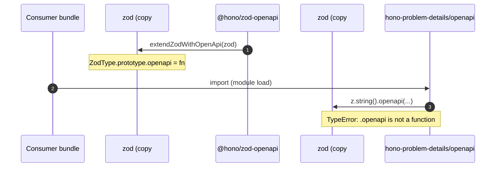

# ADR-0004: Defer OpenAPI schema construction via factory function

## Status

Accepted

## Context

The `./openapi` integration exported `ProblemDetailsSchema` as a module-top-level
const built by chaining `z.string().openapi(...)` calls. This works in
single-`zod`-instance environments, but fails with
`TypeError: e.string(...).openapi is not a function` whenever the bundler resolves
two copies of `zod` — one patched by `@hono/zod-openapi`'s prototype extension,
one not. This was reported in [issue #133][issue] against a large Cloudflare
Workers bundle (esbuild via `wrangler deploy`), and is reproducible whenever
pnpm strict hoisting, npm peer-mismatch, or monorepo layouts duplicate the `zod`
dependency.

The bug surface is module-load-time evaluation: by the time the consumer's first
line of code runs, the throw has already happened. There is no consumer-side
mitigation other than not importing the module.

### The failure mode



The patched prototype lives on `zod` copy #1. `hono-problem-details/openapi`'s
top-level body runs against copy #2, where the prototype is still vanilla.

### Repair strategies considered

Three repair strategies were considered:

1. **Proxy wrapper preserving the `ProblemDetailsSchema` const export** — wrap a
   lazily-constructed real schema in `new Proxy({}, { get, ... })`, forwarding
   method calls and property access. Preserves the existing API surface.
2. **Hybrid (Proxy + boundary-unwrap)** — same Proxy, but `problemDetailsResponse`
   internally resolves the Proxy to the real schema before handing it to
   `OpenAPIHono`.
3. **Factory function** — drop `ProblemDetailsSchema`, expose
   `getProblemDetailsSchema()` instead. Consumers call it explicitly. Breaking
   change to the public API.

An uncommitted throwaway spike (not preserved in the repository) verified all three
under `zod@4.3.6` + `@hono/zod-openapi@1.3.0` +
`@asteasolutions/zod-to-openapi@8.5.0`:

- **Proxy** core mechanics (`.shape`, `.safeParse`, `.extend`, `.openapi`) pass.
  But when the Proxy is registered as a route response schema in `OpenAPIHono`,
  the generated OpenAPI document loses `title: "ProblemDetails"`. Root cause:
  `zod-to-openapi` v8 stores metadata in a global `Map<ZodSchema, metadata>`
  keyed by schema identity (a Map-backed registry inside `@asteasolutions/zod-to-openapi`).
  The Proxy and its wrapped schema have different identities, so registry
  lookup fails.
- **Hybrid** repairs the bug only for consumers who route through
  `problemDetailsResponse`. Any consumer passing `ProblemDetailsSchema` directly
  to `OpenAPIHono` still sees the lost title. Worse, the Proxy hits invariant
  violations (`getOwnPropertyDescriptor` on `_zod`) when downstream code
  introspects Zod v4 internals — recoverable with more traps, but the complexity
  is unbounded.
- **Factory** works cleanly. Lazy by definition (no work at module load),
  identity-preserving (the returned schema is a real `ZodObject` the registry
  knows about), and immune to bundler-induced `zod` copies because `.openapi()`
  evaluation is deferred until the consumer's code is already running.

### Why Proxy cannot reach the registry

```mermaid
flowchart TD
    subgraph proxy[Proxy approach — fails]
        P1[ProblemDetailsSchema = Proxy wrapping lazy schema]
        P2[Consumer hands Proxy to OpenAPIHono]
        P3[zod-to-openapi: Map.get of Proxy]
        P4[Map key is the real ZodObject inside]
        P5[Lookup MISS — title undefined]
        P1 --> P2 --> P3 --> P4 --> P5
    end

    subgraph factory[Factory approach — works]
        F1[Consumer calls getProblemDetailsSchema]
        F2[Real ZodObject built and registered]
        F3[Consumer hands real schema to OpenAPIHono]
        F4[zod-to-openapi: Map.get of real schema]
        F5[HIT — title 'ProblemDetails']
        F1 --> F2 --> F3 --> F4 --> F5
    end
```



## Decision

Drop `ProblemDetailsSchema` (the const export) entirely. Replace with
`getProblemDetailsSchema()`, a memoized factory that returns the real
`z.ZodObject<{...}>` on demand. Update `createProblemDetailsSchema` and
`problemDetailsResponse` to call the factory internally — their public function
signatures stay the same.

This is a breaking change for `./openapi` consumers. It ships as v0.7.0
following the project's pre-1.0 convention of using minor bumps for breaking
changes (cf. v0.5.0 widening peer deps, v0.4.0 changing the `extensions.stack`
contract).

### Migration

```ts
// Before (v0.6.x)
import { ProblemDetailsSchema } from "hono-problem-details/openapi";
app.openapi(createRoute({
  responses: {
    400: { content: { "application/problem+json": { schema: ProblemDetailsSchema } }, description: "Bad Request" },
  },
}));

// After (v0.7.0) — option 1: bind locally
import { getProblemDetailsSchema } from "hono-problem-details/openapi";
const ProblemDetailsSchema = getProblemDetailsSchema();
app.openapi(createRoute({
  responses: {
    400: { content: { "application/problem+json": { schema: ProblemDetailsSchema } }, description: "Bad Request" },
  },
}));

// After (v0.7.0) — option 2: use the helper (preferred)
import { problemDetailsResponse } from "hono-problem-details/openapi";
app.openapi(createRoute({
  responses: { 400: problemDetailsResponse(400) },
}));
```

## Consequences

**Positive**:

- The bug is fixed at the root: schema construction can no longer execute before
  the consumer's bundle finishes resolving and patching `zod`.
- No Proxy machinery, no boundary-unwrap edge cases, no Zod v4 internal-coupling
  fragility.
- Identity contracts with `zod-to-openapi`'s registry are preserved.

**Negative**:

- Existing code that imports `ProblemDetailsSchema` as a value breaks. Migration
  is mechanical (`import { ProblemDetailsSchema }` →
  `const ProblemDetailsSchema = getProblemDetailsSchema()`), but visible.
- `getProblemDetailsSchema()` is memoized at module level via a closure, which
  restores referential identity for repeated callers within the same module
  instance — but cross-bundle duplicate-instance scenarios will produce one
  cached schema per bundle. This is acceptable because the alternative (sharing
  a registry across bundles) is what caused the original bug.
- README, type-compat tests, and downstream examples need updating.

## Regression tests

The following tests must land alongside the implementation to prevent recurrence:

1. **Lazy-eval test** — spy on `z.ZodType.prototype.openapi`, import the
   module, and assert the spy was NOT called; then call
   `getProblemDetailsSchema()` and assert the spy WAS called. Proves
   construction is deferred past module load.
2. **OpenAPI integration test** — assert that `getProblemDetailsSchema()`
   result, when registered with `OpenAPIHono`, emits `title: "ProblemDetails"`
   in the generated OpenAPI 3.1 document.
3. **Type-compat consumer** — `tests/type-compat/core-consumer.ts` must use
   `getProblemDetailsSchema()` so the TS 5.0/5.4/5.7/5.9/6.0 matrix guards the
   public API.

[issue]: https://github.com/paveg/hono-problem-details/issues/133
